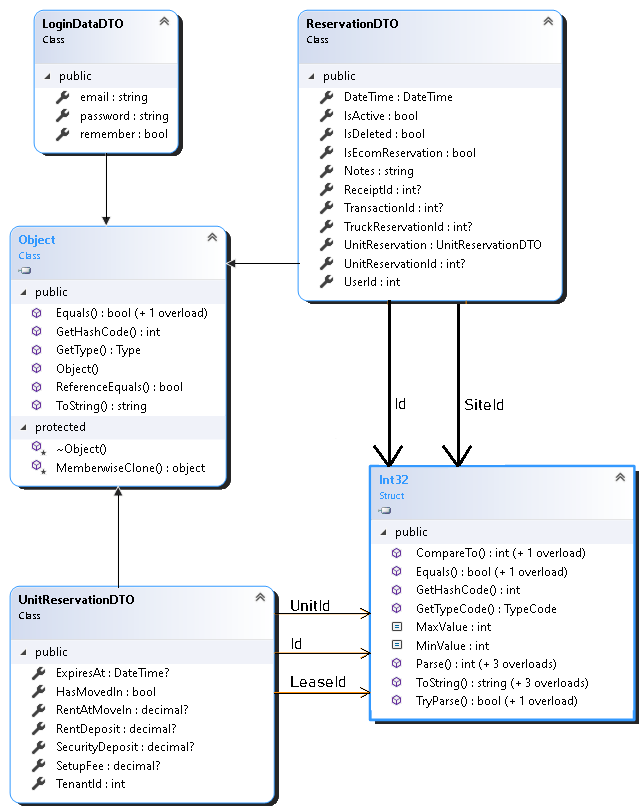

# How To Reserve

Remember that no matter what you do, you always need authentication credentials which can be viewed [here.](https://quikstor.stoplight.io/docs/quikstor-thirdparty-access/docs/Authentication.md) and request "siteId" parameter value that are required by passing 'id' of the site you are requesting.

#### Step 1: CreateNewTenant
If you don't have a tenant yet, you'd need to create a new tenant and review our ["How To Create and Retrieve Tenant" article here.](https://quikstor.stoplight.io/docs/quikstor-thirdparty-access/docs/3.-How-To-Create-and-Retrieve-Tenant.md)

You can also see [createTenant endpoints.]()

If you have an existing tenant, you can call [getTenant]() to retrieve tenant information then you can move on to step 2 and 3 of this article. 

#### Step 2: Check GetAvailableUnits
Once you have tenant information set up, you can retrieve information on all of the available vacant unit types that are ready to be reserved by calling [getAvailableUnitsTypes.](../reference/ThirdParty.v1.json/paths/quikstor_online~1api~1<partner-name>~1getavailableunittypes)

#### Step 3: Call POST method to create reservation 
Finally, you can create reservation by calling [createReservation post method](../reference/ThirdParty.v1.json/paths/~1api~1<partner-name>~1createreservation)